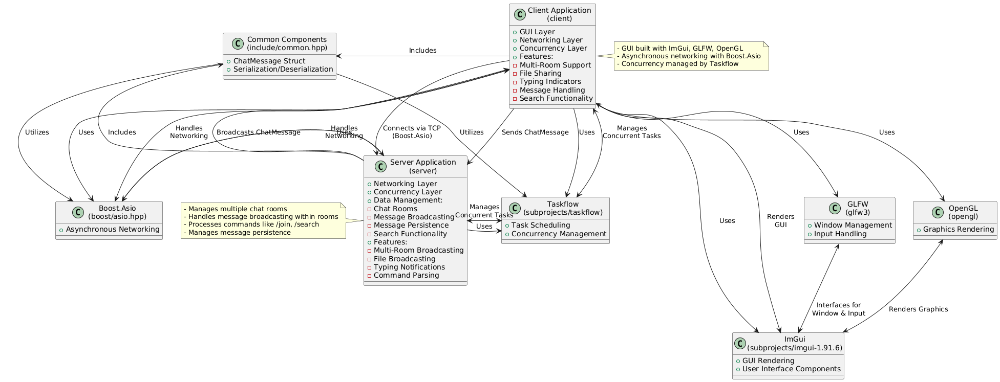

# DissChat

**DissChat** is a modern, high-performance, and feature-rich distributed chat application written in C++. Leveraging powerful libraries such as **Boost.Asio**, **Taskflow**, and **Dear ImGui**, DissChat offers a seamless and responsive user experience with advanced concurrency and networking capabilities. Whether you're building a simple chat room or a complex communication platform, DissChat provides the flexibility and scalability needed to meet your requirements.

## Table of Contents

1. [Features](#features)
2. [Architecture](#architecture)
3. [Installation](#installation)
4. [Building the Project](#building-the-project)
5. [Running the Application](#running-the-application)
6. [Usage Guide](#usage-guide)
7. [Future Enhancements](#future-enhancements)

## Features

DissChat is packed with a variety of advanced features designed to provide a robust and user-friendly chatting experience:

1. **Multi-Room Support**
   - **Join Multiple Channels:** Users can join different chat rooms or channels to communicate within specific groups.
   - **Room Management:** Create, join, and leave rooms seamlessly using simple commands.

2. **Real-Time Messaging**
   - **Instant Message Delivery:** Messages are delivered in real-time with minimal latency.
   - **Typing Indicators:** See when other users are typing, enhancing the conversational experience.

3. **File Sharing**
   - **Attach and Share Files:** Users can attach files to their messages and share them within the chat rooms.
   - **Efficient File Transfer:** Handles small to moderately large files efficiently with support for chunking.

4. **Message Persistence & Search**
   - **In-Memory Message Logs:** The server maintains logs of all messages within each room.
   - **Search Functionality:** Users can search for specific keywords within the chat history.

5. **User Authentication**
   - **Secure Logins:** Authenticate users with username and password before allowing access to chat rooms.
   - **Session Management:** Manage user sessions securely to prevent unauthorized access.

6. **Theming & Customization**
   - **ImGui Styling:** Customize the client interface with various ImGui themes and styles.
   - **Responsive UI:** The user interface adapts to different screen sizes and resolutions.

7. **Advanced Concurrency**
   - **Taskflow Integration:** Utilize Taskflow for managing complex asynchronous tasks and pipelines.
   - **Scalable Performance:** Efficiently handles multiple concurrent connections and operations.

8. **Encryption (Optional)**
   - **TLS/SSL Support:** Secure communications using TLS/SSL with Boost.Asio's SSL streams.
   - **Certificate Management:** Load and manage server certificates for encrypted connections.

9. **Notifications**
   - **Sound Alerts:** Receive audio notifications for new messages or events.
   - **Desktop Notifications:** Get system-level notifications for important chat activities.

10. **Extensible Architecture**
    - **Modular Design:** Easily extend the application with new features or integrations.
    - **Database Integration:** Potential to integrate with databases for enhanced data persistence.

## Architecture

DissChat follows a client-server architecture with the following components:

- **Server**
  - **Networking:** Utilizes Boost.Asio for asynchronous TCP networking.
  - **Concurrency:** Employs Taskflow to manage and execute concurrent tasks efficiently.
  - **Room Management:** Manages multiple chat rooms, message broadcasting, and user sessions.
  - **Persistence:** Maintains in-memory logs of messages with potential for database integration.

- **Client**
  - **User Interface:** Built with Dear ImGui and GLFW for a responsive and customizable GUI.
  - **Networking:** Connects to the server using Boost.Asio for real-time communication.
  - **Concurrency:** Uses Taskflow for managing asynchronous operations like sending and receiving messages.
  - **Features:** Supports multi-room navigation, file sharing, typing indicators, and more.



*High-Level Architecture of DissChat*

## Installation

### Prerequisites

Before building DissChat, ensure you have the following dependencies installed on your system:

- **C++ Compiler:** Supports C++20 (e.g., GCC 10+, Clang 11+, MSVC 2019+)
- **Meson Build System:** Version 0.55.0 or higher
- **Ninja Build Tool**
- **Boost Libraries:** Including `system`, `thread`, and `asio`
- **Taskflow:** Included as a subproject
- **Dear ImGui:** Included as a subproject
- **GLFW:** For window and input management
- **OpenGL:** Core profile for rendering
- **SDL2 (Optional):** If integrating additional features
- **SQLite3 (Optional):** For message persistence

### Installing Dependencies

#### macOS (Using Homebrew)

```bash
brew install boost meson ninja glfw3
```

#### Linux (Ubuntu/Debian)

```bash
sudo apt update
sudo apt install build-essential libboost-all-dev meson ninja-build libglfw3-dev libglew-dev libsqlite3-dev
```

#### Windows

1. **Boost:** Download and install Boost from [Boost Downloads](https://www.boost.org/users/download/).
2. **GLFW:** Download binaries from [GLFW](https://www.glfw.org/download.html) or build from source.
3. **ImGui & Taskflow:** Included as subprojects; ensure Meson can locate them.

## Building the Project

DissChat uses the **Meson** build system with **Ninja** as the backend. Follow these steps to build both the server and client executables.

1. **Clone the Repository**

   ```bash
   git clone https://github.com/yourusername/disschat.git
   cd disschat
   ```

2. **Initialize Subprojects**

   Ensure that `Taskflow` and `Dear ImGui` are present in the `subprojects/` directory. If not, add them using Meson's subproject mechanism or place their source code manually.

3. **Set Up the Build Directory**

   ```bash
   meson setup build
   ```

   *Note:* If dependencies are in non-standard locations, you may need to specify additional options, e.g., `-Dboost_root=/path/to/boost`.

4. **Compile the Project**

   ```bash
   meson compile -C build
   ```

   This will build both the `server` and `client` executables.

## Running the Application

### Starting the Server

1. **Navigate to the Build Directory**

   ```bash
   cd build
   ```

2. **Run the Server**

   ```bash
   ./server [port]
   ```

   - **`port`**: (Optional) The port number the server listens on. Defaults to `5555` if not specified.

   **Example:**

   ```bash
   ./server 5555
   ```

   **Output:**

   ```
   [Server] Listening on port 5555
   ```

### Starting the Client

1. **Navigate to the Build Directory**

   ```bash
   cd build
   ```

2. **Run the Client**

   ```bash
   ./client
   ```

   **Output:**

   ```
   [Client] Connected to 127.0.0.1:5555
   ```

## Usage Guide

Once both the server and client are running, you can utilize the following features:

### 1. **Connecting to the Server**

- Launch the server on your desired port (default `5555`).
- Start the client, which will automatically connect to `localhost:5555`.
- To connect to a different host or port, modify the client code or enhance it with command-line arguments.

### 2. **Joining and Managing Rooms**

- **Default Room:** Upon connecting, clients are placed in the `General` room.
- **Joining a New Room:**
  - Enter the desired room name in the `Room` input field.
  - Click the `Join` button or send the command `/join <RoomName>`.
  - The client will switch to the specified room, and messages will be broadcasted only within that room.

### 3. **Sending Messages**

- Enter your name in the `Name` field.
- Type your message in the `Message` input box.
- Click `Send` or press `Enter` to dispatch the message.
- Messages appear in the `Chat Log` with the sender's name and room context.

### 4. **Typing Indicators**

- When a user is typing, a `Typing...` indicator is displayed to other users in the same room.
- This feature enhances the conversational experience by signaling active participation.

### 5. **File Sharing**

- Enter the file path in the `File path` input box.
- Click `Attach File` to send the file to the current room.
- Files are transmitted as binary data and can be retrieved by recipients.

### 6. **Message Search**

- Use the `/search <keyword>` command to find messages containing specific keywords within the current room.
- The server processes the search and returns relevant messages to the client.

### 7. **Customizing the Interface**

- **Theming:** Utilize ImGui's styling options to customize the appearance of the chat client.
- **Responsive Layout:** The interface adjusts to different window sizes and resolutions for optimal user experience.

### 8. **Security and Encryption (Optional)**

- **TLS/SSL:** Enable secure communications by configuring Boost.Asio's SSL streams and managing certificates.
- **User Authentication:** Implement secure login mechanisms to verify user identities before granting access.

## Acknowledgements

- **Boost.Asio:** For providing a robust asynchronous networking library.
- **Taskflow:** For simplifying task management and concurrency.
- **Dear ImGui:** For the flexible and efficient graphical user interface.
- **GLFW:** For window and input handling.
- **OpenGL:** For rendering graphics within the client application.
- **Open Source Contributors:** Thanks to all the contributors of the libraries and tools that make DissChat possible.

## Future Enhancements

DissChat is continuously evolving. Here are some planned and potential future features:

- **Database Integration:** Implement persistent storage using SQLite or other databases for message history and user data.
- **Advanced Security:** Enhance encryption mechanisms and implement OAuth for authentication.
- **Mobile Client:** Develop a mobile version of the client for Android and iOS platforms.
- **Voice and Video Chat:** Integrate real-time voice and video communication capabilities.
- **Bot Integration:** Allow bots to participate in chat rooms for automation and moderation.
- **Custom Emojis and Stickers:** Expand the messaging experience with rich media content.
- **User Profiles:** Enable detailed user profiles with avatars and status messages.
- **Admin Controls:** Provide administrative tools for managing rooms and users.